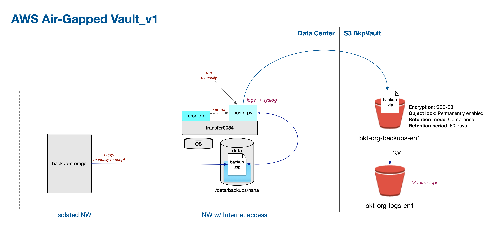

# air-gapped-backups
Python script and instructions how to set up an air-gapped vault in AWS for malware protected backups.  
The script supports configurations for different environments (dev, test, qa, prod) - script and logging configs.  
The script can be manually run or set up to run automatically with cron job. If automatic, the file need to be removed 
or deleted between runs to avoid multiple version of the same file in S3. 

To set up AWS with an air-gapped account, read more in [docs](docs/Home.md).



## Python support
Recommended Python ≥ 3.10

## Limitations
* A file with the same name will be added as a new version of the file in S3, even if it is exactly the same file.
* The script does not remove the copied file -> Running the script more then once will create a additional versions.
* The bucket set up in Compliance mode, i.e. "write only - automatic delete" so an uploaded file can not be manually deleted. 

## Set up and run the script 
1. Install needed packages: `pip install -r requirements.txt`
2. Add an `.env` file in the project root stating your environment (dev, test, qa, prod):  
   ```ENV=dev```  
   This is used for the path to config files: `<env>-config,json`, `<env>-secrets` and `<env>-logging-config.json`
3. Copy the example files in `config/`, remove `_example` and add your values.
4. Run the script with the following parameters: `"/Path/to/local/directory" "FileInDirectory.txt" "FolderInS3"`
